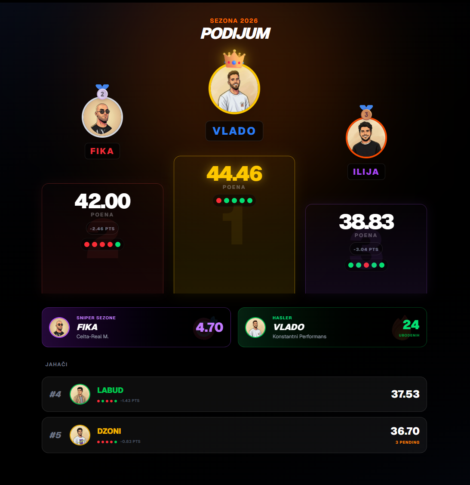
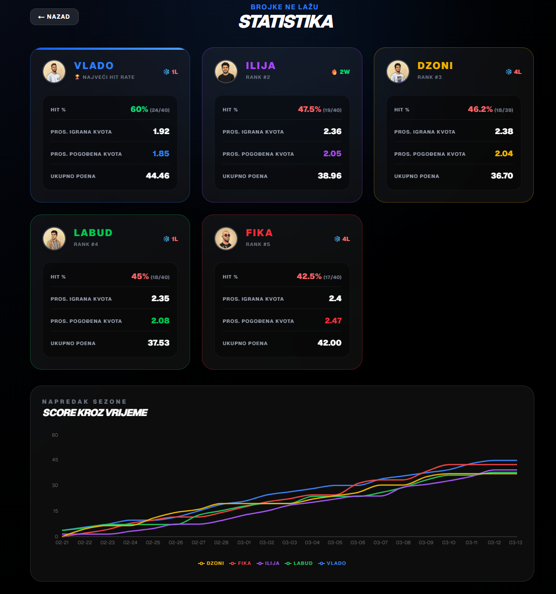
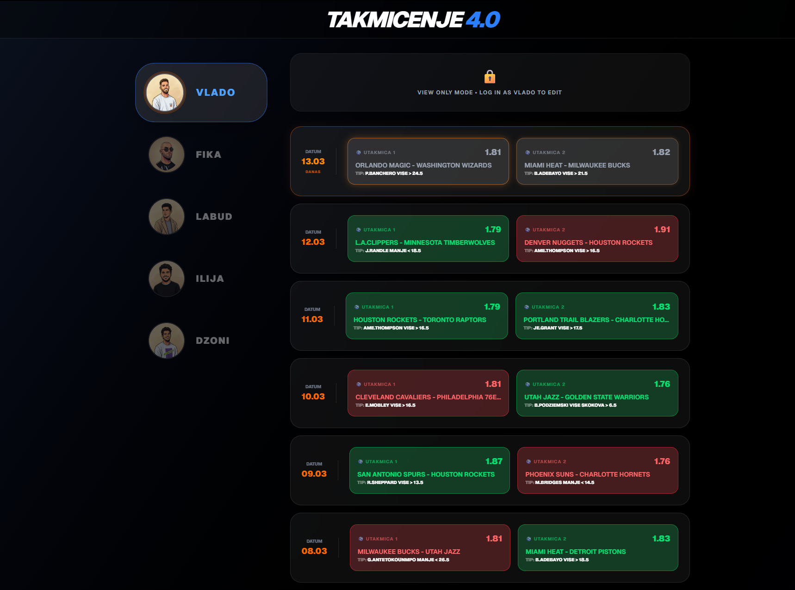

# Takmičenje 4.0 🏆

A private sports betting competition tracker for 5 players, built as a PWA so it works on mobile like a native app.

---

## Screenshots

> _Learderboard_



> _Statistics_


> _PlayerTables_


---

## Features

- 🏆 Live leaderboard with player rankings
- 📊 Per-player bet tracking with win/loss/pending status
- 📈 Statistics view with charts and performance breakdowns
- 🔒 Auth with per-player row-level permissions (Supabase RLS)
- 👁 Guest / view-only mode for spectators
- 📱 PWA with pull-to-refresh, installable on iOS and Android
- ⚡ Lazy-loaded statistics page for fast initial load

---

## Tech Stack

- [Next.js 14](https://nextjs.org/) — React framework
- [Supabase](https://supabase.com/) — Auth and database
- [Tailwind CSS](https://tailwindcss.com/) — Styling
- [Recharts](https://recharts.org/) — Statistics charts
- [Zod](https://zod.dev/) — Form validation

---

## Live Demo

🔗 [https://takmicenje4-0.vercel.app/](https://takmicenje4-0.vercel.app/)

> Login is restricted to competition participants. Use the username: GUEST & password: guest on the login screen to browse as a guest.

---

## Local Setup

1. Clone the repo
   ```bash
   git clone https://github.com/tenkac/takmicenje4.0
   cd betting-game
   ```

2. Install dependencies
   ```bash
   npm install
   ```

3. Copy the environment file and fill in your Supabase keys
   ```bash
   cp .env.example .env.local
   ```

4. Run the development server
   ```bash
   npm run dev
   ```

---

## Environment Variables

```bash
NEXT_PUBLIC_SUPABASE_URL=your_supabase_url
NEXT_PUBLIC_SUPABASE_ANON_KEY=your_supabase_anon_key
```

---

## Database

The app uses a single `player_bets` table in Supabase with one row per player. Each row stores all bets as a JSON array.

Row Level Security is enabled:
- Authenticated users can read all rows (leaderboard works for everyone)
- Users can only update their own row
- Insert and delete are disabled

---

## License

MIT